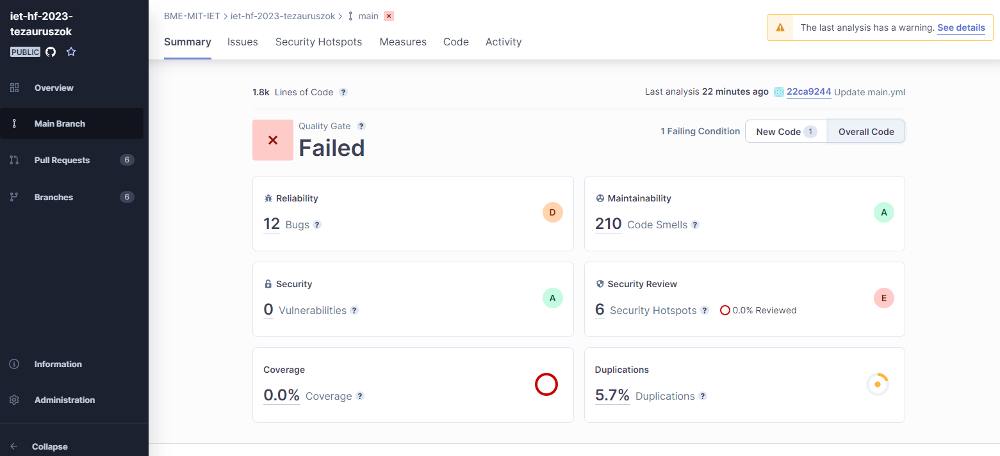

# Manuális kódátvizsgálás + Statikus analízis eszköz futtatása dokumentáció 

A házi feladat során a Szoftver projekt laboratórium tárgyra készített alkalmazás ellenőrzésével foglalkoztunk. Az egyik kiválasztott feladat egy statikus analízis eszköz futtatása, a jelzett hibák javítása, illetve a kód egy részének manuális átvizsgálása volt.

Statikus ellenőrzéshez a SonarCloud platformot használtuk. A Github Actions seítségével történő analízis kiválasztása után egy új secretet kellett létrehozni, melyben megadtuk a leírásban szereplő tokent. Ezek után a github/workflows mappában létrehozott main.yaml fájl, illetve a gyökérkönyvtárban elhelyezkedő sonar-project.properties fájlok tartalmát kellett megfelelően kitölteni. A main.yml fájlban többek között be lehet állítani pull requestek, illetve branchek analíziseinek konfigurációját (pl. melyik branchre, milyen művelet hatására induljon ellenőrzés). A sonar-project.properties fájlban a projektkulcs és szervezetnév mellett a java osztályaink elérési útját kellett megadni a sonar.java.binaries paraméter értékeként.

Az összegzés fülön látszik, hogy a main ágon 12 bug és 210 code smellt talált az eszköz. A csapattal való egyeztetés alapján a bugokat illetve a legkritikusabb code smellek közül párat külön brancheken javítottunk majd csináltunk belőlük pull requesteket. Ezeket a pull requesteket a csapat másik tagjaihoz rendeltük, hogy manuálisan átnézzék a változtatásokat, ezzel segítve egymás munkájának felülbírálását.

Egy olyan eszközt ismerhettünk meg, ami rávilágít az emberi tévedés által elmulasztott hibákra, hasznos önellenőrző funkció, amit érdemes minden projekthez hozzárendelni. Ezen felül odafigyeltünk egymás ellenőrzésére, felülvizsgálására is, ami bevett gyakorlat a szoftverfejlesztésben, érdemes volt ezt a szokást gyakorolnunk.
