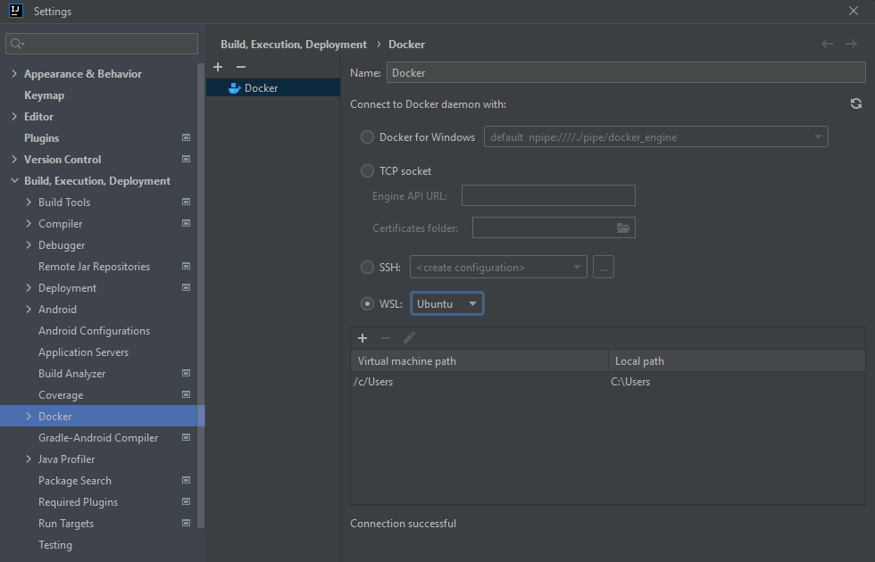
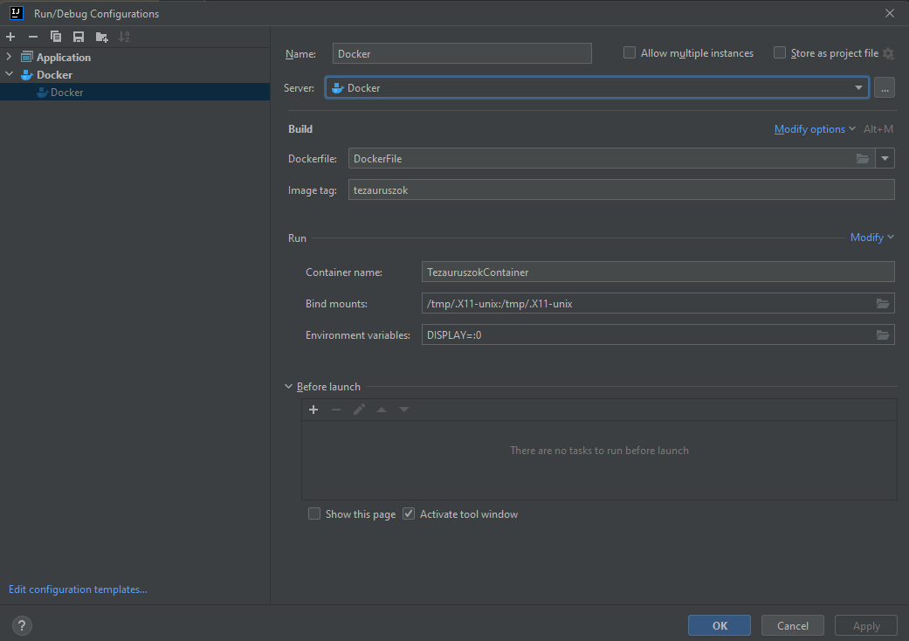

# Deployment segítése - Dokumentáció
---
Az egyik kiválasztott feladatunk a Technológiai fókusz kategóriából a Deployment segítése. A dockerizálást választottuk ennek a feladatnak a megoldására. Az alkalmazás egy java gui alkalmazás, így a dockerben való futtatáshoz a dockernek át kell adni egy ablakkezelő szolgáltatást melyen keresztül a gazda operációsrendszer meg tudja jeleníteni az ablakot.

Windows rendszeren alapból nincs ablakkezelő szolgáltatás, viszont az újabb windows verziókban elérhető az integrált linux alrendszer (WSL) melyek rendelkeznek X11 ablakkezelőbel alapértelmezetten. Ezt használtuk a megoldáshoz, a docker konténer futtatásakor env változóként átadjuk a WSL ablakkezelőjét, hogy ezt használja a docker ablakkezelőként.

IntelliJ eszközt használunk a fejlesztéshez, a feladatmegoldásban leginkább arra fókuszáltunk, hogy ebben a környezetben működjön automatikusan a fordítás és futtatás a docker beépítésével.

## DockerFile

Ez a fájl tartalmazza a docker image buildeléséhez a konfigurációt. A kiinduló image választása azért lett ubuntu openjdk-17 helyett mert utóbbiban nem lehet apt csomagokat telepíteni és az image nem tartalmazza a libcext csomagot. Erre azért van szükség, mert másképp nem jelennek meg az ablakok a konténeren belül.

Az ubuntu rendszerre a RUN apt-get parancsok futtatásával telepítésre kerülnek a szükséges csomagok (beleértve a java futtatókörnyezetet)

A kódot nem a docker konténer fogja fordítani, oda már az intelliJ által lefordított futtatható források átmásolásra kerülnek.

```
FROM ubuntu:latest

RUN apt-get update && apt-get install -y --no-install-recommends \
    openjdk-17-jdk \
    libxext6 \
    libxtst6 \
    libxrender1

COPY ./out/production/kod/ /tmp
WORKDIR /tmp
ENTRYPOINT ["java","game.Main"]
```

Ezzel létrejön az image melyet futtathatunk a megfelelő paraméterek beállítását követően.

## Konténer futtatása

### Parancssorból

Parancssori futtatáshoz át kell váltani a windows operációs rendszeren a WSL konzolára és ott kell kiadni az alábbi parancsot:
```
docker rm -f tezauruszokContainer &&
docker run -it --name=tezauruszokContainer -v /tmp/.X11-unix:/tmp/.X11-unix -e DISPLAY tezauruszok bash
```

A WSL konzolra váltásra azért van szükség mert a windows konzolból nem tudjuk átadni a /tmp/X11-unix állományt a konténernek.

### IntelliJ autómatikus build konfiguráció

Az intelliJ 2023-mas verziójában van lehetőség a dockert a WSL-en keresztül használni. Ez a *Settings>Build, Execution, Deployment>Docker* menüpontban beállítható.



A DockerFile lefuttatásához és a konténer automatikus elindításához szükség van egy Docker build konfigurációra.



Itt be kell állítani, hogy a Build-hez melyik dockerfile tartozik. Opcionálisan adható az image-nek tag. Ennek hiányában véletlenszerű elnevezése lesz az image-nek.

A run opcióknál meg kell adni az x11 állomány összekötését és fel kell venni a DISPLAY változót. Ennek az intelliJ vár mindenképp paramétert, ezért megadjuk a 0-t. Ez az elsődleges képernyőt jelenti a rendszerben. 

Itt is megadható a konténernek név. Ez azért hasznos mert így újabb buildkor a konténer felülíródik. 