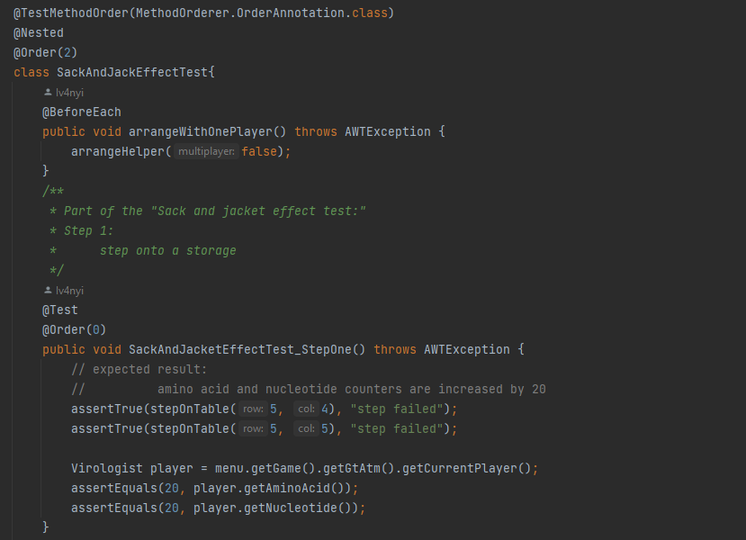

# UI teszt dokumentáció

## Bevezetés
Ezen a branch-en a Szoftver Projekt Laboratórium-ra elkészített Java projektének az Integrációs és ellenőrzési technikák házi feladatához kapcsolódó termék/felhasználó fókusz feladatcsoportjából választott UI tesztelés található, melyet a következő módon építettünk fel->

## Struktúra

A (teszt)működés a  SwingUITest.java forrásfájlba lett megírva, benne számos metódus található, amelyek különböző műveleteket végeznek az alkalmazás felhasználói felületével. A teszteléshez a Robot osztályt használja, amely lehetővé teszi a felhasználói interakciók automatizálását, így az automatikus UI tesztelést a mi esetünkben.

## 

A kódban az alábbi fő metódusok találhatók:

* stepOnTable: Ez a metódus egy lépést végrehajt a játékmezőn, a megadott sor és oszlop alapján. Az egér mozgatásával és kattintásával teszi meg a lépést, majd ellenőrzi, hogy a játékos a megadott pozícióra lépett-e.

* openInventory és closeInventory: Ezek a metódusok megnyitják és bezárják a játékos felszerelését (inventory) az alkalmazásban. Az egér mozgatásával és kattintásával érik el ezt a műveletet.

* craftSomething: Ez a metódus egy craftolási műveletet hajt végre az inventoryban. Az egér mozgatásával és kattintásával választja ki a megadott sorszámú elemet, majd elvégzi a craftolást.

* attackTarget: Ez a metódus egy támadást hajt végre a játékban. Az egér mozgatásával és kattintásával választja ki a megadott azonosítójú célpontot, majd végrehajtja a támadást.

* arrangeHelper: Ez a metódus előkészíti a játékot a tesztekhez. A főmenüt nyitja meg, kiválasztja a játékos nevét, majd elindítja a játékot. Van egy- és két játékos üzemmódja, ilyenkor több játékos lesz a játék elején kiválasztva.

Ezen felül a SwingUITest osztályban található több (összesen 4) beágyazott osztály, melyek különböző fő teszteseteket jelképeznek. Egy osztály konkrét tesztlépéseket tartalmaz, amelyek különböző műveleteket végeznek a játékban, mint például lépéseket tesz és tárgyakat vesz fel a játékmezőről. A teszt lépések egymásra építenek, de oly módon, hogy minden lépésben lefutnak az előző lépésig a (kattintásos) műveletek, de minden lépésnél csak az aktuális elvárt eredmény van összehasonlítva a kapottakkal, így az előzőek sikertelen kimenetele nem (feltétlenül) okozza a következő teszt sikertelenségét.

A tesztek az @Test annotációval vannak ellátva, és a @BeforeEach és @AfterEach annotációkkal jelölt metódusokat használják az előkészületek és a szükséges takarítás elvégzéséhez.

## Példa

A SackAndJackEffectTest osztály egy beágyazott teszteseteket tartalmazó osztály a SwingUITest osztályon belül. A tesztek a @Test annotáción felül a @Order annotációval vannak ellátva, hogy meghatározzuk a futtatási sorrendjüket.

Az arrangeWithOnePlayer metódus a tesztek előtt fut le, és beállítja a játékot egy játékossal, hiszen ebben a fő tesztesetben erre van szükség.

Az osztályban szereplő tesztek a csapattársunk, Benyovszki Patrik manuális tesztjein alapulva a "Sack and jacket effect test" részleteit tesztelik. 

*kapcsolódó részlet a kódból*

1. A SackAndJacketEffectTest_StepOne teszt a következő lépéseket végzi el:

    A játékos egy raktárra lép.
    Ellenőrzi, hogy aminosav és nukleotid számlálók 20-zal növekedtek.

2. A SackAndJacketEffectTest_StepTwo teszt a következő lépéseket végzi el:

    A játékos egy bunkerre lép, ahol van egy zsák.
    Ellenőrzi, hogy az inventory-ban van-e zsák.

3. A SackAndJacketEffectTest_StepThree teszt a következő lépéseket végzi el:

    A játékos ismét egy raktárra lép.
    Ellenőrzi, hogy az aminosav és nukleotid számlálók 21-gyel növekedtek.

Az @AfterEach annotációval jelölt closeGameWindow metódus az aktuális játékablakot zárja be a tesztek után.

Összefoglalva a tesztek különböző lépéseket tesztelnek a játékban, például a játékos lépéseit, az inventory kezelését és az erőforrások növekedését. Az egyes lépések végrehajtásához a stepOnTable metódust használják, amely az egér mozgatásával és kattintásával automatizálja a lépéseket a játékmezőn.